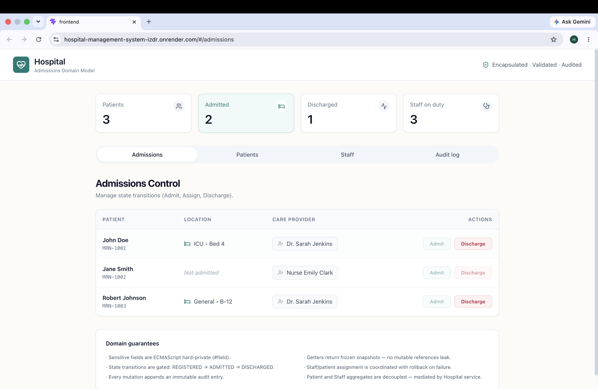
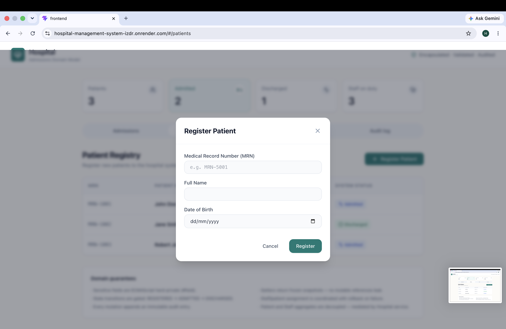
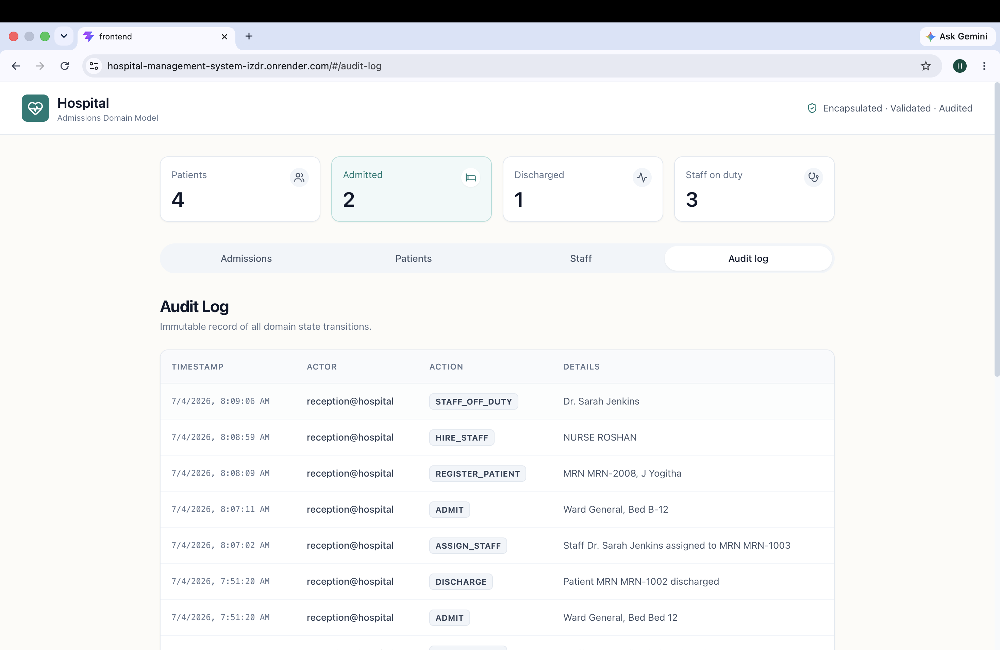

# 🏥 Hospital Management System (Domain Model)

**Live Demo:** [https://hospital-management-system-izdr.onrender.com](https://hospital-management-system-izdr.onrender.com)

A full-stack web application built to demonstrate core Object-Oriented Programming (OOP) concepts such as Encapsulation, Domain-Driven Design (DDD), and Controlled State Transitions.

## 📸 Screenshots

*(Replace these placeholders by saving your screenshots into the `docs/images` folder!)*

### 1. Patient Dashboard

*Real-time statistics and strict state tracking for all patients.*

### 2. Registration Modal

*Validating constraints (like unique MRNs) before patient creation.*

### 3. Immutable Audit Log

*Every action is securely recorded in the system, preventing data tampering.*

---

## 🛠 Technology Stack
- **Frontend**: React + Vite + Tailwind CSS (Deployed on Render)
- **Backend**: Java 17 + Spring Boot + Spring Data JPA (Deployed on Render via Docker)
- **Database**: H2 In-Memory Database (For zero-configuration, "run-anywhere" deployment)

## 🏗 OOP & Domain Concepts Demonstrated
- **Strict Encapsulation**: Entities (`Patient`, `Staff`) have strictly private fields. There are no public setters that bypass state logic.
- **Controlled State Transitions**: A patient cannot be discharged without being admitted first. State flows strictly from `REGISTERED` → `ADMITTED` → `DISCHARGED`.
- **Capacity Constraints**: Doctors have a strict maximum limit of 12 patients; Nurses have a limit of 8. Attempting to assign more throws a custom domain exception.
- **Immutable Auditing**: Every mutating action (admitting, assigning doctors) generates an immutable `AuditLog` entry that tracks the actor, action, and timestamp.
- **DTO Pattern**: Mutable database entities are never returned to the API. Read-only Data Transfer Objects (DTOs) are mapped for security.

## 🚀 How to Run Locally

Because this project uses an H2 in-memory database, it requires **zero external database setup**.

1. **Clone the repository:**
   ```bash
   git clone https://github.com/yogitha261006/hospital-management-system.git
   cd hospital-management-system
   ```

2. **Start the Spring Boot Backend:**
   ```bash
   cd backend
   ./mvnw spring-boot:run
   ```
   *The backend will start on `http://localhost:8080`.*

3. **Start the React Frontend:**
   Open a new terminal and navigate to the frontend:
   ```bash
   cd frontend
   npm install
   npm run dev
   ```
   *The frontend will start on `http://localhost:5173`. Open this URL in your browser.*

## 🐳 Docker Deployment
This project is configured with a multi-stage `Dockerfile` to bundle the React frontend and Spring Boot backend into a single container for effortless deployment to platforms like Render.com.
